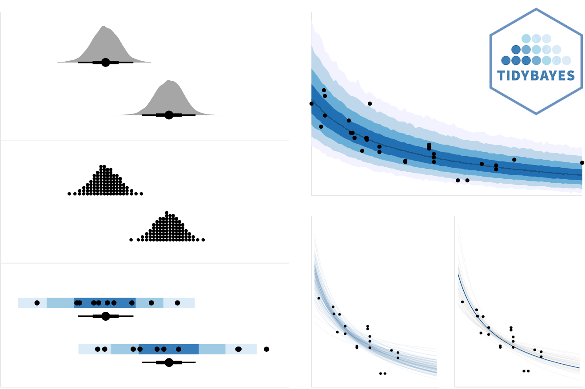
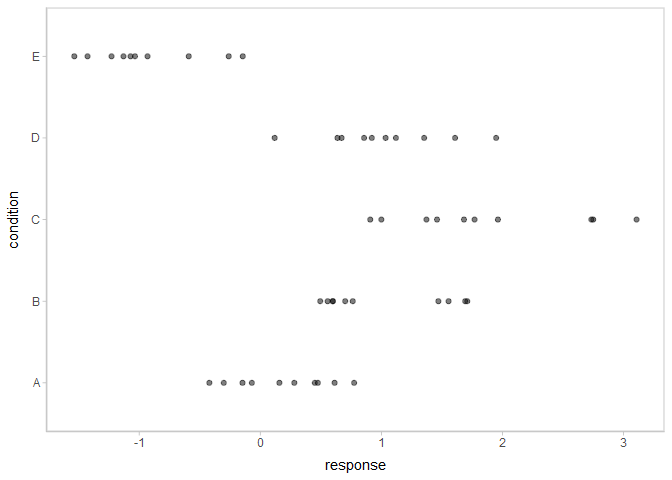
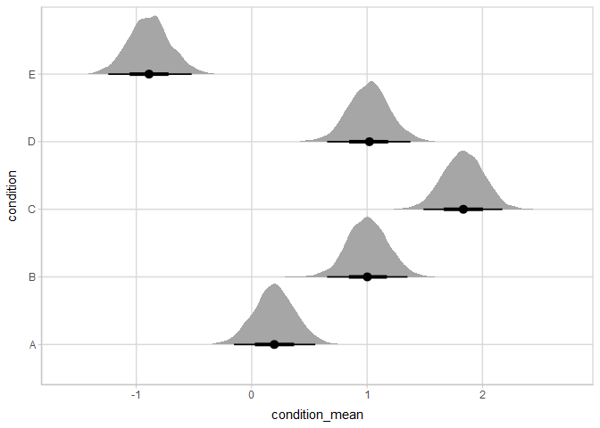
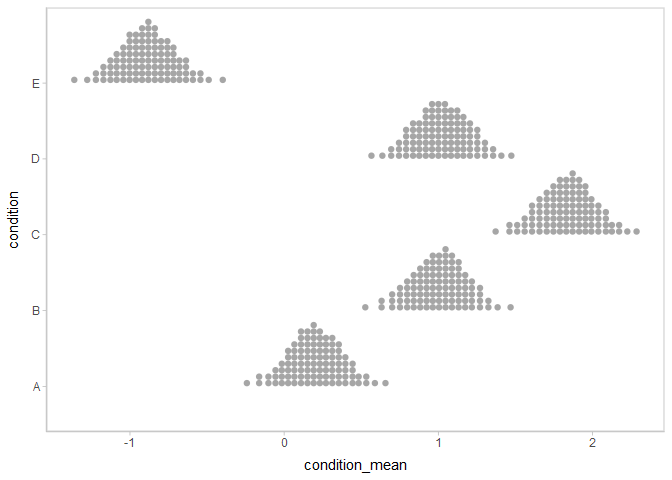
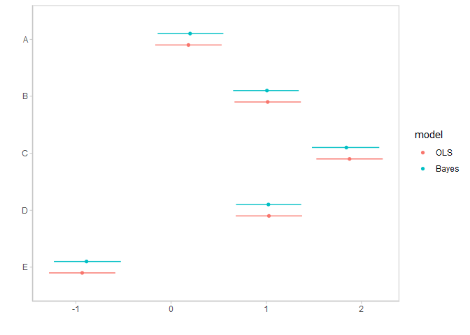
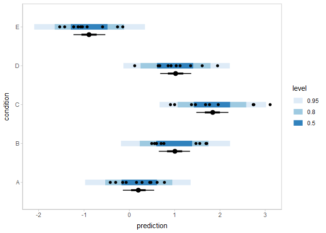
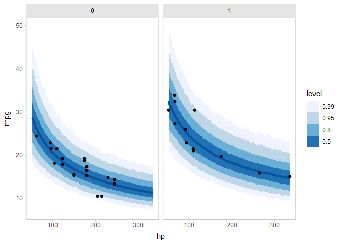
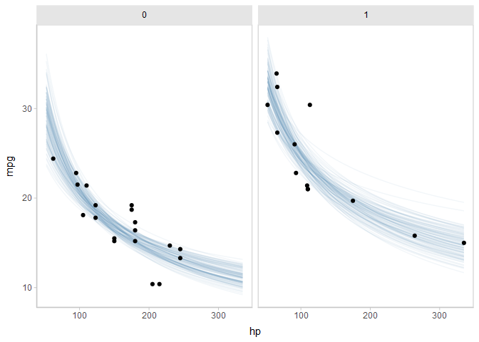
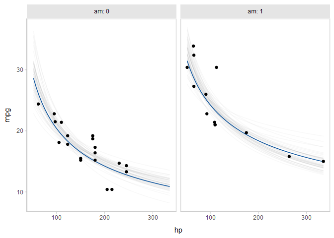

# tidybayes: Bayesian analysis + tidy data + geoms 

[](https://travis-ci.org/mjskay/tidybayes)
[](https://github.com/mjskay/tidybayes/actions)
[](https://codecov.io/github/mjskay/tidybayes?branch=master)
[](https://cran.r-project.org/package=tidybayes)

[](https://zenodo.org/badge/latestdoi/33396684)



`tidybayes` is an R package that aims to make it easy to integrate
popular Bayesian modeling methods into a tidy data + ggplot workflow.

[Tidy](http://cran.r-project.org/web/packages/tidyr/vignettes/tidy-data.html)
data frames (one observation per row) are particularly convenient for
use in a variety of R data manipulation and visualization packages.
However, when using Bayesian modeling functions like JAGS or Stan in R,
we often have to translate this data into a form the model understands,
and then after running the model, translate the resulting sample (or
predictions) into a more tidy format for use with other R functions.
`tidybayes` aims to simplify these two common (often tedious)
operations:

  - **Composing data** for use with the model. This often means
    translating data from a `data.frame` into a `list` , making sure
    `factors` are encoded as numerical data, adding variables to store
    the length of indices, etc. This package helps automate these
    operations using the `compose_data` function, which automatically
    handles data types like `numeric`, `logical`, `factor`, and
    `ordinal`, and allows easy extensions for converting other data
    types into a format the model understands by providing your own
    implementation of the generic `as_data_list`.

  - **Extracting tidy draws** from the model. This often means
    extracting indices from parameters with names like `"b[1,1]"`,
    `"b[1,2]"` into separate columns of a data frame, like `i =
    c(1,1,..)` and `j = c(1,2,...)`. More tediously, sometimes these
    indices actually correspond to levels of a factor in the original
    data; e.g. `"x[1]"` might correspond to a value of `x` for the first
    level of some factor. We provide several straightforward ways to
    convert draws from a variable with indices into useful long-format
    (“[tidy](http://cran.r-project.org/web/packages/tidyr/vignettes/tidy-data.html)”)
    data frames, with automatic back-conversion of common data types
    (factors, logicals) using the `spread_draws` and `gather_draws`
    functions, including automatic recovery of factor levels
    corresponding to variable indices. In most cases this kind of
    long-format data is much easier to use with other data-manipulation
    and plotting packages (e.g., `dplyr`, `tidyr`, `ggplot2`) than the
    format provided by default from the model.

`tidybayes` also provides some additional functionality for data
manipulation and visualization tasks common to many models:

  - **Extracting tidy fits and predictions** from models. For models
    like those provided by `rstanarm` and `brms`, `tidybayes` provides a
    tidy analog of the `fitted` and `predict` functions, called
    `add_fitted_draws` and `add_predicted_draws`. These functions are
    modeled after the `modelr::add_predictions` function, and turn a
    grid of predictions into a long-format data frame of draws from
    either the fits or predictions from a model. These functions make it
    straightforward to generate arbitrary fit lines from a model.

  - **Summarizing posterior distributions** from models. The
    `point_interval` family of functions (`median_qi`, `mean_qi`,
    `mode_hdi`, etc) are methods for generating point summaries and
    intervals that are designed with tidy workflows in mind. They can
    generate point summaries plus an arbitrary number of probability
    intervals *from* tidy data frames of draws, they *return* tidy data
    frames, and they **respect data frame groups**.

  - **Visualizing priors and posteriors**. The focus on tidy data makes
    the output from tidybayes easy to visualize using `ggplot`. Existing
    `geom`s (like `geom_pointrange` and `geom_linerange`) can give
    useful output, but `tidybayes` also includes several geoms and stats
    to simplify common combinations of `stats` and `geoms` with sensible
    defaults suitable for visualizing posterior point summaries and
    intervals (`geom_pointinterval()`, `geom_pointintervalh()`,
    `stat_pointinterval()`, `stat_pointintervalh()`), visualizing
    distributions with point summaries and intervals (the
    `stat_sample_slabinterval()` family of stats, including eye plots,
    half-eye plots, CCDF bar plots, gradient plots, dotplots, and
    histograms), and visualizing fit lines with an arbitrary number of
    uncertainty bands (`geom_lineribbon` and `stat_lineribbon`). Priors
    can also be visualized in the same way using the
    `stat_dist_slabinterval()` family of stats. The
    `geom_dotsinterval()` family also automatically finds good binning
    parameters for dotplots, and can be used to easily construct
    quantile dotplots of posteriors (see example in this document).
    
    
    
    See `vignette("slabinterval")` for more information.

  - **Comparing a variable across levels of a factor**, which often
    means first generating pairs of levels of a factor (according to
    some desired set of comparisons) and then computing a function over
    the value of the comparison variable for those pairs of levels.
    Assuming your data is in the format returned by `spread_draws`, the
    `compare_levels` function allows comparison across levels to be made
    easily.

Finally, `tidybayes` aims to fit into common workflows through
**compatibility with other packages**:

  - Drop-in functions to translate tidy column names used by `tidybayes`
    to/from names used by other common packages and functions, including
    column names used by `ggmcmc::ggs` (via `to_ggmcmc_names` and
    `from_ggmcmc_names`) and column names used by `broom::tidy` (via
    `to_broom_names` and `from_broom_names`), which makes comparison
    with results of other models straightforward.

  - The `unspread_draws` and `ungather_draws` functions invert
    `spread_draws` and `gather_draws`, aiding compatibility with other
    Bayesian plotting packages (notably `bayesplot`).

  - The `gather_emmeans_draws` function turns the output from
    `emmeans::emmeans` (formerly `lsmeans`) into long-format data frames
    (when applied to supported model types, like `MCMCglmm` and
    `rstanarm` models).

## Supported model types

`tidybayes` aims to support a variety of models with a uniform
interface. Currently supported models include
[rstan](https://cran.r-project.org/package=rstan),
[brms](https://cran.r-project.org/package=brms),
[rstanarm](https://cran.r-project.org/package=rstanarm),
[runjags](https://cran.r-project.org/package=runjags),
[rjags](https://cran.r-project.org/package=rjags),
[jagsUI](https://cran.r-project.org/package=jagsUI), [coda::mcmc and
coda::mcmc.list](https://cran.r-project.org/package=coda),
[MCMCglmm](https://cran.r-project.org/package=MCMCglmm), and anything
with its own `as.mcmc.list` implementation. If you install the
[tidybayes.rethinking](https://github.com/mjskay/tidybayes.rethinking)
package, models from the
[rethinking](https://github.com/rmcelreath/rethinking) package are also
supported.

## Installation

You can install the currently-released version from CRAN with this R
command:

``` r
install.packages("tidybayes")
```

Alternatively, you can install the latest development version from
GitHub with these R commands:

``` r
install.packages("devtools")
devtools::install_github("mjskay/tidybayes")
```

## Examples

This example shows the use of tidybayes with the Stan modeling language;
however, tidybayes supports many other model types, such as JAGS, brm,
rstanarm, and (theoretically) any model type supported by
`coda::as.mcmc.list`.

``` r
library(magrittr)
library(dplyr)
library(ggplot2)
library(ggstance)
library(rstan)
library(tidybayes)
library(emmeans)
library(broom)
library(brms)
library(modelr)
library(forcats)
library(cowplot)
library(RColorBrewer)
library(gganimate)

theme_set(theme_tidybayes() + panel_border() + background_grid())
```

Imagine this dataset:

``` r
set.seed(5)
n = 10
n_condition = 5
ABC =
  tibble(
    condition = rep(c("A","B","C","D","E"), n),
    response = rnorm(n * 5, c(0,1,2,1,-1), 0.5)
  )

ABC %>%
  ggplot(aes(x = response, y = condition)) +
  geom_point(alpha = 0.5) +
  ylab("condition")
```

<!-- -->

A hierarchical model of this data might fit an overall mean across the
conditions (`overall_mean`), the standard deviation of the condition
means (`condition_mean_sd`), the mean within each condition
(`condition_mean[condition]`) and the standard deviation of the
responses given a condition mean (`response_sd`):

``` stan
data {
  int<lower=1> n;
  int<lower=1> n_condition;
  int<lower=1, upper=n_condition> condition[n];
  real response[n];
}
parameters {
  real overall_mean;
  vector[n_condition] condition_zoffset;
  real<lower=0> response_sd;
  real<lower=0> condition_mean_sd;
}
transformed parameters {
  vector[n_condition] condition_mean;
  condition_mean = overall_mean + condition_zoffset * condition_mean_sd;
}
model {
  response_sd ~ cauchy(0, 1);         // => half-cauchy(0, 1)
  condition_mean_sd ~ cauchy(0, 1);   // => half-cauchy(0, 1)
  overall_mean ~ normal(0, 5);
  condition_zoffset ~ normal(0, 1);   // => condition_mean ~ normal(overall_mean, condition_mean_sd)
  for (i in 1:n) {
    response[i] ~ normal(condition_mean[condition[i]], response_sd);
  }
}
```

### Composing data for input to model: `compose_data`

We have compiled and loaded this model into the variable `ABC_stan`.
Rather than munge the data into a format Stan likes ourselves, we will
use the `tidybayes::compose_data` function, which takes our `ABC` data
frame and automatically generates a list of the following elements:

  - `n`: number of observations in the data frame
  - `n_condition`: number of levels of the condition factor
  - `condition`: a vector of integers indicating the condition of each
    observation
  - `response`: a vector of observations

So we can skip right to modeling:

``` r
m = sampling(ABC_stan, data = compose_data(ABC), control = list(adapt_delta=0.99))
```

### Getting tidy draws from the model: `spread_draws`

We decorate the fitted model using `tidybayes::recover_types`, which
will ensure that numeric indices (like `condition`) are back-translated
back into factors when we extract data:

``` r
m %<>% recover_types(ABC)
```

Now we can extract variables of interest using `spread_draws`, which
automatically parses indices, converts them back into their original
format, and turns them into data frame columns. This function accepts a
symbolic specification of Stan variables using the same syntax you would
to index columns in Stan. For example, we can extract the condition
means and the residual standard deviation:

``` r
m %>%
  spread_draws(condition_mean[condition], response_sd) %>%
  head(15)  # just show the first few rows
```

    ## Warning: `combine()` is deprecated as of dplyr 1.0.0.
    ## Please use `vctrs::vec_c()` instead.
    ## This warning is displayed once every 8 hours.
    ## Call `lifecycle::last_warnings()` to see where this warning was generated.

    ## # A tibble: 15 x 6
    ## # Groups:   condition [1]
    ##    condition condition_mean .chain .iteration .draw response_sd
    ##    <chr>              <dbl>  <int>      <int> <int>       <dbl>
    ##  1 A                 0.157       1          1     1       0.673
    ##  2 A                 0.362       1          2     2       0.532
    ##  3 A                 0.195       1          3     3       0.565
    ##  4 A                 0.245       1          4     4       0.535
    ##  5 A                 0.134       1          5     5       0.510
    ##  6 A                 0.273       1          6     6       0.511
    ##  7 A                -0.0745      1          7     7       0.627
    ##  8 A                 0.116       1          8     8       0.610
    ##  9 A                 0.0902      1          9     9       0.485
    ## 10 A                 0.210       1         10    10       0.594
    ## 11 A                 0.118       1         11    11       0.478
    ## 12 A                 0.218       1         12    12       0.544
    ## 13 A                 0.238       1         13    13       0.493
    ## 14 A                 0.0558      1         14    14       0.607
    ## 15 A                 0.180       1         15    15       0.582

The condition numbers are automatically turned back into text (“A”, “B”,
“C”, …) and split into their own column. A long-format data frame is
returned with a row for every draw \(\times\) every combination of
indices across all variables given to `spread_draws`; for example,
because `response_sd` here is not indexed by `condition`, within the
same draw it has the same value for each row corresponding to a
different `condition` (some other formats supported by `tidybayes` are
discussed in `vignette("tidybayes")`; in particular, the format returned
by `gather_draws`).

### Plotting posteriors as eye plots: `stat_eye` / `stat_eyeh`

Automatic splitting of indices into columns makes it easy to plot the
condition means here. We will employ the `tidybayes::stat_eyeh` geom
(horizontal version of `tidybayes::stat_eye`), which combines a violin
plot of the posterior density, median, 66% and 95% quantile interval to
give an “eye plot” of the posterior. The point and interval types are
customizable using the `point_interval` family of functions. A
“half-eye” plot (non-mirrored density) is also available as
`tidybayes::stat_halfeyeh`.

``` r
m %>%
  spread_draws(condition_mean[condition]) %>%
  ggplot(aes(x = condition_mean, y = condition)) +
  stat_eyeh()
```

<!-- -->

Or one can employ the similar “half-eye” plot:

``` r
m %>%
  spread_draws(condition_mean[condition]) %>%
  ggplot(aes(x = condition_mean, y = condition)) +
  stat_halfeyeh()
```

<!-- -->

A variety of other stats and geoms for visualizing priors and posteriors
are available; see `vignette("slabinterval")` for an overview of them.

### Plotting posteriors as quantile dotplots

Intervals are nice if the alpha level happens to line up with whatever
decision you are trying to make, but getting a shape of the posterior is
better (hence eye plots, above). On the other hand, making inferences
from density plots is imprecise (estimating the area of one shape as a
proportion of another is a hard perceptual task). Reasoning about
probability in frequency formats is easier, motivating [quantile
dotplots](https://github.com/mjskay/when-ish-is-my-bus/blob/master/quantile-dotplots.md)
([Kay et al. 2016](https://doi.org/10.1145/2858036.2858558), [Fernandes
et al. 2018](https://doi.org/10.1145/3173574.3173718)), which also allow
precise estimation of arbitrary intervals (down to the dot resolution of
the plot, 100 in the example below).

Within the slabinterval family of geoms in tidybayes is the `dots` and
`dotsinterval` family, which automatically determine appropriate bin
sizes for dotplots and can calculate quantiles from samples to construct
quantile dotplots. `stat_dotsh()` is the horizontal variant designed for
use on samples:

``` r
m %>%
  spread_draws(condition_mean[condition]) %>%
  ggplot(aes(x = condition_mean, y = condition)) +
  stat_dotsh(quantiles = 100) 
```

<!-- -->

The idea is to get away from thinking about the posterior as indicating
one canonical point or interval, but instead to represent it as (say)
100 approximately equally likely points.

### Point and interval summaries

The functions `tidybayes::median_qi`, `tidybayes::mean_qi`,
`tidybayes::mode_hdi`, etc (the `point_interval` functions) give tidy
output of point summaries and intervals:

``` r
m %>%
  spread_draws(condition_mean[condition]) %>%
  median_qi(condition_mean)
```

    ## # A tibble: 5 x 7
    ##   condition condition_mean .lower .upper .width .point .interval
    ##   <chr>              <dbl>  <dbl>  <dbl>  <dbl> <chr>  <chr>    
    ## 1 A                  0.196 -0.153  0.551   0.95 median qi       
    ## 2 B                  1.00   0.654  1.35    0.95 median qi       
    ## 3 C                  1.83   1.49   2.17    0.95 median qi       
    ## 4 D                  1.02   0.654  1.38    0.95 median qi       
    ## 5 E                 -0.890 -1.24  -0.520   0.95 median qi

### Comparison to other models via compatibility with `broom`

Translation functions like `tidybayes::to_broom_names`,
`tidybayes::from_broom_names`, `tidybayes::to_ggmcmc_names`, etc. can be
used to translate between common tidy format data frames with different
naming schemes. This makes it easy, for example, to compare points
summaries and intervals between `tidybayes` output and models that are
supported by `broom::tidy`.

For example, let’s compare against ordinary least squares (OLS)
regression:

``` r
linear_results = 
  lm(response ~ condition, data = ABC) %>% 
  emmeans(~ condition) %>% 
  tidy() %>%
  mutate(model = "OLS")
linear_results
```

    ## # A tibble: 5 x 7
    ##   condition estimate std.error    df conf.low conf.high model
    ##   <fct>        <dbl>     <dbl> <dbl>    <dbl>     <dbl> <chr>
    ## 1 A            0.182     0.173    45   -0.167     0.530 OLS  
    ## 2 B            1.01      0.173    45    0.665     1.36  OLS  
    ## 3 C            1.87      0.173    45    1.53      2.22  OLS  
    ## 4 D            1.03      0.173    45    0.678     1.38  OLS  
    ## 5 E           -0.935     0.173    45   -1.28     -0.586 OLS

Using `tidybayes::to_broom_names`, we’ll convert the output from
`median_qi` (which uses names `.lower` and `.upper`) to use names from
`broom` (`conf.low` and `conf.high`) so that comparison with output from
`broom::tidy` is easy:

``` r
bayes_results = m %>%
  spread_draws(condition_mean[condition]) %>%
  median_qi(estimate = condition_mean) %>%
  to_broom_names() %>%
  mutate(model = "Bayes")
bayes_results
```

    ## # A tibble: 5 x 8
    ##   condition estimate conf.low conf.high .width .point .interval model
    ##   <chr>        <dbl>    <dbl>     <dbl>  <dbl> <chr>  <chr>     <chr>
    ## 1 A            0.196   -0.153     0.551   0.95 median qi        Bayes
    ## 2 B            1.00     0.654     1.35    0.95 median qi        Bayes
    ## 3 C            1.83     1.49      2.17    0.95 median qi        Bayes
    ## 4 D            1.02     0.654     1.38    0.95 median qi        Bayes
    ## 5 E           -0.890   -1.24     -0.520   0.95 median qi        Bayes

This makes it easy to bind the two results together and plot them:

``` r
bind_rows(linear_results, bayes_results) %>%
  ggplot(aes(y = condition, x = estimate, xmin = conf.low, xmax = conf.high, color = model)) +
  geom_pointintervalh(position = position_dodgev(height = .3))
```

<!-- -->

Shrinkage towards the overall mean is visible in the Bayesian results.

Compatibility with `broom::tidy` also gives compatibility with
`dotwhisker::dwplot`:

``` r
bind_rows(linear_results, bayes_results) %>%
  rename(term = condition) %>%
  dotwhisker::dwplot() 
```

<!-- -->

### Posterior prediction and complex custom plots

The tidy data format returned by `spread_draws` also facilitates
additional computation on variables followed by the construction of more
complex custom plots. For example, we can generate posterior predictions
easily, and use the `.width` argument (passed internally to `median_qi`)
to generate any number of intervals from the posterior predictions, then
plot them alongside point summaries and the data:

``` r
m %>%
  spread_draws(condition_mean[condition], response_sd) %>%
  mutate(prediction = rnorm(n(), condition_mean, response_sd)) %>%
  ggplot(aes(y = condition)) +
  
  # posterior predictive intervals
  stat_intervalh(aes(x = prediction), .width = c(.5, .8, .95)) +
  scale_color_brewer() +
  
  # median and quantile intervals of condition mean
  stat_pointintervalh(aes(x = condition_mean), .width = c(.66, .95), position = position_nudge(y = -0.2)) +
  
  # data
  geom_point(aes(x = response), data = ABC)
```

<!-- -->

This plot shows 66% and 95% quantile credible intervals of posterior
median for each condition (point + black line); 95%, 80%, and 50%
posterior predictive intervals (blue); and the data.

### Fit curves

For models that support it (like `rstanarm` and `brms` models), We can
also use the `add_fitted_draws` or `add_predicted_draws` functions to
generate posterior fits or predictions. Combined with the functions from
the `modelr` package, this makes it easy to generate fit curves.

Let’s fit a slightly naive model to miles per gallon versus horsepower
in the `mtcars` dataset:

``` r
m_mpg = brm(
  mpg ~ log(hp), 
  data = mtcars, 
  family = lognormal,

  file = "README_models/m_mpg.rds" # cache model (can be removed)  
)
```

Now we will use `modelr::data_grid`, `tidybayes::add_predicted_draws`,
and `tidybayes::stat_lineribbon` to generate a fit curve with multiple
probability bands:

``` r
mtcars %>%
  data_grid(hp = seq_range(hp, n = 101)) %>%
  add_predicted_draws(m_mpg) %>%
  ggplot(aes(x = hp, y = mpg)) +
  stat_lineribbon(aes(y = .prediction), .width = c(.99, .95, .8, .5), color = "#08519C") +
  geom_point(data = mtcars, size = 2) +
  scale_fill_brewer()
```

<!-- -->

`stat_lineribbon(aes(y = .prediction), .width = c(.99, .95, .8, .5))` is
one of several shortcut geoms that simplify common combinations of
`tidybayes` functions and `ggplot` geoms. It is roughly equivalent to
the following:

``` r
  stat_summary(
    aes(y = .prediction, fill = forcats::fct_rev(ordered(stat(.width))), group = -stat(.width)), 
    geom = "ribbon", point_interval = median_qi, fun.args = list(.width = c(.99, .95, .8, .5))
  ) +
  stat_summary(aes(y = .prediction), fun.y = median, geom = "line", color = "red", size = 1.25)
```

Because this is all tidy data, if you wanted to build a model with
interactions among different categorical variables (say a different
curve for automatic and manual transmissions), you can easily generate
predictions faceted over that variable (say, different curves for
different transmission types). Then you could use the existing faceting
features built in to ggplot to plot them.

Such a model might be:

``` r
m_mpg_am = brm(
  mpg ~ log(hp) * am, 
  data = mtcars, 
  family = lognormal,

  file = "README_models/m_mpg_am.rds" # cache model (can be removed)  
)
```

Then we can generate and plot predictions as before (differences from
above are highlighted as comments):

``` r
mtcars %>%
  data_grid(hp = seq_range(hp, n = 101), am) %>%    # add am to the prediction grid
  add_predicted_draws(m_mpg_am) %>%
  ggplot(aes(x = hp, y = mpg)) +
  stat_lineribbon(aes(y = .prediction), .width = c(.99, .95, .8, .5), color = "#08519C") +
  geom_point(data = mtcars) +
  scale_fill_brewer() +
  facet_wrap(~ am)                                  # facet by am
```

<!-- -->

Or, if you would like overplotted posterior fit lines, you can instead
use `tidybayes::add_fitted_draws` to get draws from fit lines (instead
of predictions), select some reasonable number of them (say `n = 100`),
and then plot them:

``` r
mtcars %>%
  data_grid(hp = seq_range(hp, n = 200), am) %>%
  add_fitted_draws(m_mpg_am, n = 100) %>%         # sample 100 fits from the posterior
  ggplot(aes(x = hp, y = mpg)) +
  geom_line(aes(y = .value, group = .draw), alpha = 1/20, color = "#08519C") +
  geom_point(data = mtcars) +
  facet_wrap(~ am)
```

<!-- -->

Animated hypothetical outcome plots (HOPs) can also be easily
constructed by using `gganimate`:

``` r
set.seed(12345)
ndraws = 50

p = mtcars %>%
  data_grid(hp = seq_range(hp, n = 50), am) %>%
  add_fitted_draws(m_mpg_am, n = ndraws) %>%
  ggplot(aes(x = hp, y = mpg)) +
  geom_line(aes(y = .value, group = .draw), color = "#08519C") +
  geom_point(data = mtcars) +
  facet_wrap(~ am, labeller = label_both) +
  transition_states(.draw, 0, 1) +
  shadow_mark(past = TRUE, future = TRUE, alpha = 1/20, color = "gray50")

animate(p, nframes = ndraws, fps = 2.5, width = 700, height = 432, res = 100, dev = "png", type = "cairo")
```

<!-- -->

See `vignette("tidybayes")` for a variety of additional examples and
more explanation of how it works.

## Feedback, issues, and contributions

I welcome feedback, suggestions, issues, and contributions\! Contact me
at <mjskay@umich.edu>. If you have found a bug, please file it
[here](https://github.com/mjskay/tidybayes/issues/new) with minimal code
to reproduce the issue. Pull requests should be filed against the
[`dev`](https://github.com/mjskay/tidybayes/tree/dev) branch.

`tidybayes` grew out of helper functions I wrote to make my own analysis
pipelines tidier. Over time it has expanded to cover more use cases I
have encountered, but I would love to make it cover more\!

## Citing `tidybayes`

Matthew Kay (2020). *tidybayes: Tidy Data and Geoms for Bayesian
Models*. R package version 2.0.3, <https://mjskay.github.io/tidybayes/>.
DOI: [10.5281/zenodo.1308151](https://doi.org/10.5281/zenodo.1308151).
